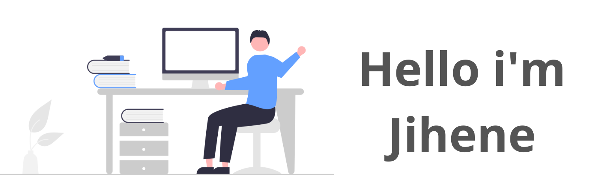

 

  
### Hi there 👋:heart:
I’m Jihene, an IT Student. My speciality is Mulimedia Web Development.

## &#x1f4c8; GitHub Stats
 

 
 

## 📌 Pinned Repositories

 

  

## 💼 Skills

More Skills

 ## 📣 How about an Office quote before you go?

> “Imagination is more important than knowledge. Knowledge is limited. Imagination circles the world.”
>
> 
- Albert Einstein

