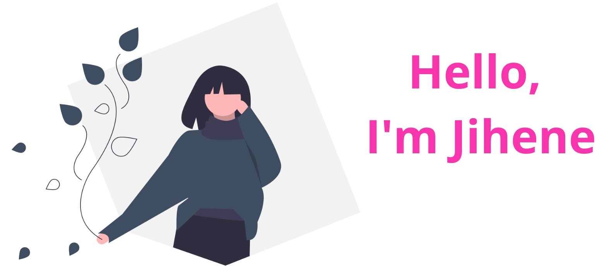

 

  
### Hi there :sparkles:
I'm Full Stack Developer (Web & Mobile) specializing
 in IoT and Artificial Intelligence. With extensive
 experience in designing and developing
 innovative applications
## &#x1f4c8; GitHub Stats
 

 
 

## 📌 Pinned Repositories

 

  

## 💼 Skills

More Skills

## 📣 How about an Office quote before you go?

> “Imagination is more important than knowledge. Knowledge is limited. Imagination circles the world.”
>
> 
- Albert Einstein

